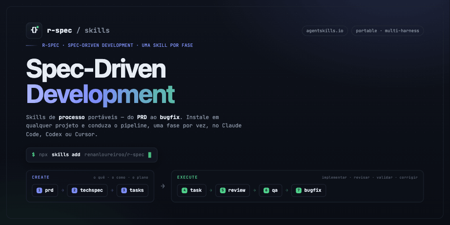

<!-- README-I18N:START -->

**Português** | [English](./README.en.md)

<!-- README-I18N:END -->

# r-spec — Spec-Driven Development Skills

Conjunto de **skills de processo** para desenvolvimento orientado a especificação (Spec-Driven Development). Cada fase do fluxo — do PRD ao bugfix — é uma skill portável, instalável em qualquer projeto e compatível com vários harnesses (Claude Code, Codex, Cursor, etc.) via [`npx skills`](https://github.com/vercel-labs/skills).

As skills seguem o spec [agentskills.io](https://agentskills.io): cada uma é uma pasta com um `SKILL.md` (frontmatter `name` + `description` + procedimento).

## Setup do projeto (uma vez): `r-init`

Antes de rodar o pipeline, use a skill **`r-init`** para preparar o projeto. Ela:

- detecta o contexto (tipo de projeto, stack, comandos, harness) — e **pergunta** o que não der para inferir;
- cria o `AGENTS.md` na raiz a partir do template, já preenchido com o que descobriu;
- cria os **subagents de review** e os **esqueletos das skills de convenção** com **fonte única em `.agents/`** (Codex/Gemini/Antigravity leem direto; só o Cursor recebe **symlink**);
- deixa placeholders explícitos do que você precisa **detalhar** em cada arquivo e orienta os próximos passos.

`r-init` faz o *scaffolding* — o conteúdo das convenções é escrito por você. Rode uma vez por projeto; depois siga o pipeline abaixo.

## O pipeline

```
create-prd  →  create-techspec  →  create-tasks  →  execute-task  →  execute-review  →  execute-qa  →  execute-bugfix
   (o quê)        (o como)          (o plano)       (implementar)     (review estático)   (QA E2E)      (corrigir)
```

| Skill             | Função                                                 | Saída                                                   |
| ----------------- | ------------------------------------------------------ | ------------------------------------------------------- |
| `create-prd`      | Levanta requisitos (faz perguntas antes de redigir)    | `tasks/<NN>-<feature>/prd.md`                           |
| `create-techspec` | Traduz o PRD em arquitetura e decisões técnicas        | `tasks/<NN>-<feature>/techspec.md`                      |
| `create-tasks`    | Quebra em tarefas com testes, aprovadas antes de gerar | `tasks/<NN>-<feature>/tasks.md` + `[num]_task.md`       |
| `execute-task`    | Implementa a próxima tarefa pendente                   | código + testes, marca `tasks.md`                       |
| `execute-tasks`   | Orquestra **todas** as tasks pendentes em ondas via subagentes (`task-executor` + `task-reviewer`) — alternativa ao loop manual de `execute-task` | código + testes por task, `[num]_task_review.md`, marca `tasks.md` |
| `execute-review`  | Code review via `git diff` contra TechSpec/Tasks/rules | `tasks/<NN>-<feature>/codereview.md`                    |
| `execute-qa`      | QA funcional: E2E (Playwright), a11y, visual           | `tasks/<NN>-<feature>/qa.md` + `bugs.md`                |
| `execute-bugfix`  | Corrige causa raiz dos bugs + testes de regressão      | `tasks/<NN>-<feature>/bugfix.md` + `bugs.md` atualizado |

Todas as fases trabalham sobre a pasta `tasks/<NN>-<feature>/` — cada feature fica autocontida (PRD, TechSpec, tasks, relatórios e bugs). Convém versionar essa pasta junto com o código.

**Contrato QA ↔ bugfix:** o `execute-qa` grava os defeitos em `bugs.md` num **formato compartilhado** (blocos `## BUG-NN` com Severidade, Passos, Resultado atual/esperado, Evidência, Status); o `execute-bugfix` lê esse mesmo formato e atualiza cada entrada (Causa raiz, Correção, Testes, `Status: Corrigido`). Cada skill traz o template embutido.

### Convenção de pastas (`tasks/NN-feature/`)

Cada feature vive em `tasks/<NN>-<slug>/`, onde:

- `<NN>` é um **contador sequencial de 2 dígitos** (`01`, `02`, …) gerado **automaticamente** pela `create-prd` — ela lê as pastas existentes em `tasks/` e usa o próximo número livre.
- `<slug>` é o nome da feature em **kebab-case**.

Exemplo: a primeira feature vira `tasks/01-painel-clima/`; a próxima, `tasks/02-checkout/`. As fases seguintes (`create-techspec` em diante) **não criam novo contador** — elas localizam a pasta existente pelo slug/maior `NN`. Para renumerar, basta renomear as pastas.

## Instalação

Executar:

```bash
# Menu interativo: escolha skills e harnesses
npx skills add https://github.com/renanloureiroo/r-spec

# Listar as skills do repo sem instalar
npx skills add https://github.com/renanloureiroo/r-spec --list

# Tudo, sem prompts (CI)
npx skills add https://github.com/renanloureiroo/r-spec --all -y

# Skills específicas para harnesses específicos
npx skills add https://github.com/renanloureiroo/r-spec --skill execute-qa -a claude-code -a cursor
```

O `npx skills` espelha cada skill para o formato do harness escolhido (`.claude/skills/`, `.agents/skills/`, `.cursor/rules/`, etc.) — não é preciso manter cópias manuais. Use `--list` para ver as skills disponíveis e `-g` para instalar no diretório do usuário (global) em vez do projeto.

## Como usar (fluxo manual)

As skills **não se encadeiam automaticamente** — você conduz o pipeline manualmente, **uma fase por vez**, acionando a skill da etapa atual. Isso mantém você no controle para revisar e aprovar cada artefato antes de seguir.

> **Passo 0 (uma vez por projeto):** rode **`r-init`** para gerar o `AGENTS.md`, os subagents e os esqueletos das skills de convenção (ver [Setup do projeto](#setup-do-projeto-uma-vez-r-init)). Depois siga a ordem abaixo por feature.

Ordem típica para uma feature nova:

1. **`create-prd`** — gera `tasks/<NN>-<slug>/prd.md` (faz perguntas antes de redigir; cria o contador `NN`). _Dica:_ já passe os **requisitos base** no prompt inicial — quanto mais contexto, menos perguntas a skill faz.
2. **`create-techspec`** — gera `techspec.md`.
3. **`create-tasks`** — gera `tasks.md` + tarefas (aprove a lista de alto nível primeiro).
4. **`execute-task`** — implementa a próxima tarefa pendente. **Repita** até concluir todas.
   - _Alternativa orquestrada:_ **`execute-tasks`** executa **todas** as tasks pendentes de uma vez — em ondas (sequencial ou paralelo conforme as dependências), com cada task implementada por um subagente `task-executor` e revisada por um `task-reviewer`, num ciclo implementação → review → correção. Requer esses subagentes instalados (ver [Subagents complementares](#subagents-complementares-opcional-claude-code)).
5. **`execute-review`** — review consolidado da feature (gera `codereview.md`).
6. **`execute-qa`** — QA funcional; gera `qa.md` e abre os bugs em `bugs.md`.
7. **`execute-bugfix`** — corrige os bugs de `bugs.md`; volte ao **`execute-qa`** para revalidar. Repita o ciclo QA ↔ bugfix até o QA aprovar sem bugs abertos.

Como acionar depende do harness — ex.: no Claude Code, peça _"use a skill `create-prd` para a feature X"_; em outros, invoque a skill equivalente. **Não pule etapas:** cada fase pressupõe os artefatos da anterior em `tasks/<NN>-<slug>/`.

> 📖 **Passo a passo completo:** veja [`example/walkthrough.md`](example/walkthrough.md) — uma simulação ponta a ponta com o prompt de cada fase, a finalização de cada etapa e os **resets de contexto** entre elas.

## O que ajustar por projeto

A maioria das skills é genérica, mas algumas têm um bloco **"Configuração por projeto"** no topo do `SKILL.md`. Edite-o após instalar:

- **`execute-qa`** _(a que mais muda)_ — URL/porta da app, comando para subir o ambiente, ferramenta de E2E, onde salvar evidências e relatório.
- **`execute-bugfix`** — comando de testes e de typecheck do projeto.
- **`execute-review`** — comando de testes/coverage, branch base, local das convenções.

Outros pontos que talvez queira adaptar:

- **Pasta de specs**: o padrão é `tasks/<NN>-<feature>/`. Se o seu projeto usa outra (`docs/specs/`, `.spec/`...), ajuste as referências de caminho nas skills.
- **Idioma/templates**: os templates de PRD e TechSpec estão em pt-BR — adapte às convenções do seu time.
- **Referências a rules/skills**: `create-techspec`, `execute-task`, `execute-review` e `execute-bugfix` consultam as convenções do projeto (regras + skills). Elas são **agnósticas de harness** — o agente deve procurá-las em dois lugares: na **raiz do projeto** (`AGENTS.md`, `CLAUDE.md`, onde muitas regras vivem hoje) e nas **pastas de skills/regras** (`.agents/skills/`, `.claude/skills/`, `.claude/rules/`, `.cursor/rules/`, etc.).

## Skills complementares (convenções de código)

Estas skills de **processo** não definem os padrões de código do seu projeto — isso fica a cargo de skills de **convenção**, que mudam de stack para stack. As fases `execute-*` as consultam. Exemplos do que vale instalar/configurar à parte:

- Padrões de código (nomenclatura, CQS, tamanho de funções)
- Convenções da linguagem/runtime (ex.: TypeScript/Node, ESM)
- Convenções de framework (ex.: React, Express)
- Convenções de teste (ex.: Vitest, Playwright)
- Estrutura de pastas do repositório
- UI/UX e design system

Mantenha-as no diretório de skills do seu harness, ao lado das skills de r-spec. **Crie ao menos uma skill de convenção por camada** que o projeto tem (uma de frontend, uma de backend) — é nelas que mora o padrão específico da sua stack. Veja exemplos reais em [`example/.agents/skills/`](example/.agents/skills/) (ex.: `react-frontend-expert`).

### Frontend / backend: uma skill genérica, foco por camada

As fases que mais variam entre camadas — **`execute-review`** e **`execute-qa`** — são **únicas e genéricas**, mas se adaptam ao **tipo do projeto** declarado no `AGENTS.md` (`frontend`, `backend` ou `fullstack`). Em vez de duplicar a skill, cada uma carrega a **referência da camada** certa:

- `execute-review` → `references/frontend.md` (UI, hooks, a11y, data fetching) ou `references/backend.md` (API/HTTP, validação, erros, segurança).
- `execute-qa` → `references/frontend.md` (E2E/Playwright, a11y, visual) ou `references/backend.md` (contrato de API/integração, **sem navegador**).
- Em projetos **fullstack**, aplica os dois ramos, segmentando pelo que cada mudança toca (`frontend/` vs `backend/`).

Basta declarar o **Tipo de projeto** no `AGENTS.md` — as skills escolhem o ramo sozinhas.

## Subagents complementares (opcional, Claude Code)

Além das skills de processo, o seu projeto pode definir **subagents** para tarefas que se beneficiam de **contexto isolado**. O caso clássico é um **revisor de task independente**: um agente que **não** implementou a tarefa a revisa em contexto limpo, sem o viés do auto-review do próprio implementador — pegando o que o `execute-task` deixou passar, antes do review consolidado da `execute-review`.

Subagents são um recurso **específico do Claude Code** (`.claude/agents/<nome>.md`, com frontmatter `name`/`description`/`model`) — outros harnesses podem não ter equivalente, e o `npx skills` **não** os instala. Por isso eles **não fazem parte do pipeline padrão**: cada projeto cria os que precisa, conforme a sua necessidade.

Há um reviewer **genérico** e dois **especializados por camada** — escolha conforme o **Tipo de projeto** e a camada da task:

| Subagent | Use para… | Tipo de projeto |
| -------- | --------- | --------------- |
| `frontend-reviewer` | Tasks de **frontend** (UI/hooks/a11y) | `frontend` ou `fullstack` |
| `backend-reviewer` | Tasks de **backend** (API/HTTP/DB) | `backend` ou `fullstack` |
| `task-reviewer` | Review genérico (uma camada só, ou sem distinção clara) | qualquer |

> 📎 **Exemplos prontos para adaptar:** [`example/.agents/agents/`](example/.agents/agents/) — `frontend-reviewer`, `backend-reviewer` e `task-reviewer` (a **fonte**; `example/.claude/agents/` são symlinks para ela). Cada um revisa um `[num]_task.md`, valida contra as convenções do projeto e a TechSpec, e grava `[num]_task_review.md` na pasta da feature. Ponha o(s) que precisar na fonte `.agents/agents/` e espelhe via **symlink** para `.claude/agents/` (e `.cursor/agents/` se usar Cursor) — nunca cópia; ajuste à sua stack/idioma/padrões.

Onde entram no fluxo (por **task**, entre implementação e review da feature) — em projetos `fullstack`, escolha o reviewer pela camada que a task tocou:

```
execute-task ──►  frontend-reviewer / backend-reviewer (subagent, contexto isolado)  ──►  execute-review
 implementa        review independente da task → [num]_task_review.md                       review da feature → codereview.md
```

### Orquestrar a feature inteira: `execute-tasks` + `task-executor`

A skill **`execute-tasks`** executa **todas** as tasks pendentes da feature de uma vez, coordenando subagentes em **ondas** (sequenciais, ou paralelas quando as dependências e os arquivos permitem). Além dos reviewers acima, ela usa um subagente **implementador** — o **`task-executor`** — que implementa cada task e aplica as correções do review; o orquestrador (o loop principal) tria cada review, pergunta ao usuário quais _minors_ aplicar e marca o `tasks.md` após a aprovação. Exemplo pronto em [`example/.agents/agents/task-executor.md`](example/.agents/agents/task-executor.md).

```
execute-tasks ──►  task-executor (implementa)  ──►  task-reviewer (review)  ──►  ✓ marca tasks.md
 orquestra em ondas        ▲                                │
                           └────── ciclo de correção ◄──────┘
```

## Configurar o `AGENTS.md` do projeto

As fases do r-spec consultam as **convenções do projeto** (regras + quais skills de arquitetura/padrões carregar), mas não as definem. Esse mapa fica no `AGENTS.md` (na **raiz** do projeto) — lido nativamente por Codex, Cursor e outros, e referenciável pelo Claude Code via `CLAUDE.md`.

> 💡 A skill **`r-init`** automatiza este passo (e mais): ela cria o `AGENTS.md` já preenchido com o contexto detectado, além dos subagents e dos esqueletos das skills de convenção. Veja [Setup do projeto](#setup-do-projeto-uma-vez-r-init). O passo manual abaixo continua válido se preferir fazer à mão.

Copie o template e preencha:

```bash
cp templates/AGENTS.md ./AGENTS.md   # na raiz do seu projeto
```

O template ([`templates/AGENTS.md`](templates/AGENTS.md)) é focado nas **referências do projeto** (não documenta o pipeline do r-spec — isso vive aqui no README). Já vem com as seções:

- **Tipo de projeto** — `frontend`, `backend` ou `fullstack`; define o ramo que `execute-review`/`execute-qa` e os subagents de review aplicam.
- **Stack** e **Comandos** — para o agente carregar as skills certas e rodar testes/lint/typecheck.
- **Regras do projeto** — idioma do código, nomenclatura, limites, padrões de erro/log, etc.
- **Skills de arquitetura e padrões** — tabela "quando acionar / quando não usar" de cada skill de convenção (preencha com as suas).
- **Subagents de review** — mapa de qual reviewer usar por camada (`frontend-reviewer`/`backend-reviewer`/`task-reviewer`).
- **MCPs** e, opcionalmente, **persistência de plano** e **notas de testes E2E**.

> Se usa Claude Code, adicione no `CLAUDE.md` uma linha apontando para o `AGENTS.md` (ex.: `Siga as convenções em @AGENTS.md`) para reaproveitar o mesmo mapa.

## MCPs recomendados

Algumas fases assumem MCPs disponíveis no harness:

- **[Context7 MCP](https://github.com/upstash/context7)** — usado por `create-techspec`, `execute-task` e `execute-bugfix` para consultar documentação atualizada de linguagens/frameworks/libs.
- **[Playwright MCP](https://github.com/microsoft/playwright-mcp)** (`browser_*`) — usado por `execute-qa` e `execute-bugfix` para E2E, acessibilidade e validação visual no navegador.

Configure-os no seu harness (ex.: `.mcp.json` / config de MCP do Claude Code, Codex ou Cursor) antes de rodar as fases que dependem deles.

## Estrutura do repositório

```
r-spec/
├── README.md
├── LICENSE
├── templates/
│   └── AGENTS.md                 # template p/ copiar na raiz do seu projeto
├── example/
│   ├── .claude/agents/           # subagents de exemplo: frontend-reviewer, backend-reviewer, task-reviewer, task-executor
│   ├── .agents/skills/           # skills de convenção de exemplo (react-frontend-expert, etc.)
│   └── tasks/01-painel-clima/    # feature de exemplo (referência viva)
└── skills/
    ├── r-init/                # SKILL.md + references/ (setup: AGENTS.md, subagents, skills de convenção)
    ├── create-prd/SKILL.md
    ├── create-techspec/SKILL.md
    ├── create-tasks/SKILL.md
    ├── execute-task/SKILL.md
    ├── execute-tasks/SKILL.md  # orquestrador (subagentes em ondas)
    ├── execute-review/         # SKILL.md + references/{frontend,backend}.md
    ├── execute-qa/             # SKILL.md + references/{frontend,backend}.md
    └── execute-bugfix/SKILL.md
```
